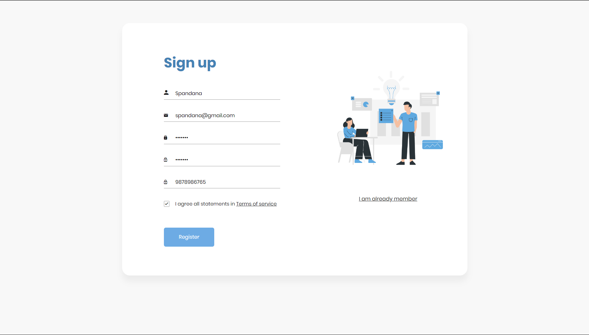

# Login and Registration Page

## Overview

This project consists of a login and registration page built using HTML, CSS, JDBC, JSP, Servlet ,MySQL. It is styled to ensure a consistent look and feel.

## Features

- **User Registration:** Allows users to create a new account by providing a username, email, and password.
- **User Login:** Enables existing users to log in using their username and password.

## Technologies Used

- HTML
- CSS
- JDBC
- JSP
- MySQL
- Servlet
- Apache Tomcat(Web Server)

